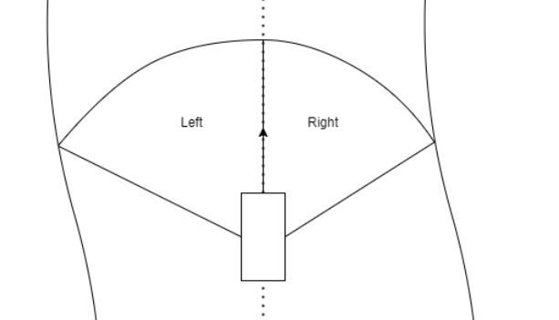

## Halves

Reference trajectory following racer utilising MPC to compute optimal paths.

The reference point is found by running the Follow The Gap algorithm twice on each side of the car, and combining the
results.

### The algorithm

To better understand the overall idea, consider below graphic:



As you can see, the area is split into two halves - the left one, and the right one. Follow The Gap algorithm will run
for each half separately and two points will be found. Then, the points are combined to form the final reference point.

The Follow The Gap algorithm finds the point by following the below steps:

- Lidar points are projected to a point cloud, to get each points coordinates
- All points that are marked as close enough to the closest point, have their lidar distance overwritten as 0 - this
is because the algorithm will try to avoid all close points so we want to form a safety radius are the closest point
- The longest non-zero sequence of lidar ranges is found among the points
- Farthest point among the non-zero sequence is found, and is treated as the target point

Both target points are combined to form a single point, which will normally result in the point somewhere near
the abscissa of the track. In case of failure to detect any valid points (all points too close or too far) in the
Follow The Gap algorithm, on either half, a default range and lidar angle is picked to avoid steering the car towards
one side only (or stopping it completely if both halves have no valid points).

### Prerequisites

F1TENTH simulator master node must be running.

The algorithm has been tuned to run on the `vegas` racing map. You can re-tune the algorithm parameters by adjusting
the values in `constants.py`.

### Usage

This sub-package follows the standard usage instructions of the parent package.

#### Run from python console

```python
from f1tenth import halves_ftg

halves_ftg.run()
```

#### Run main directly

```
python <path>/f1tenth/halves
```

or

```
python <path>/f1tenth/halves/__main__.py
```

#### Run installed files

```
python -m f1tenth.halves
```
